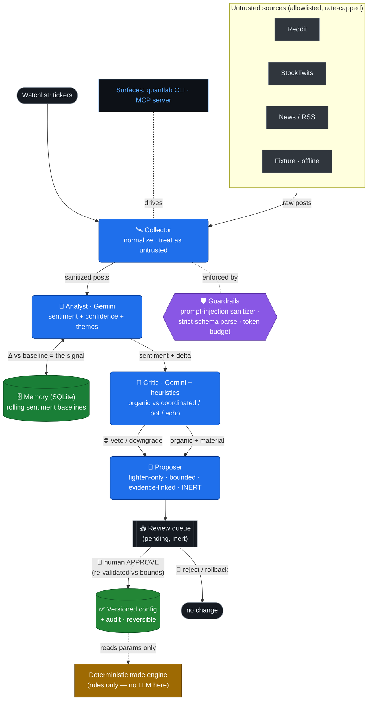

# QuantLab architecture

**Agents propose, humans dispose.** A pipeline of specialized Gemini agents turns untrusted market
chatter into a *bounded, human-approved* risk action. The LLM never touches the order path.

**Key invariants (enforced in code, not by LLM goodwill):**
- The Proposer can only emit **tighten-only, bounded** `ParamProposal`s; loosening risk is rejected.
- A proposal is **inert** until a human approves; **approval is the only path** that changes config.
- The **Critic can veto** the Analyst — multi-agent disagreement filters manipulation.
- The trade engine reads config params but the **LLM is never in the order path**.
