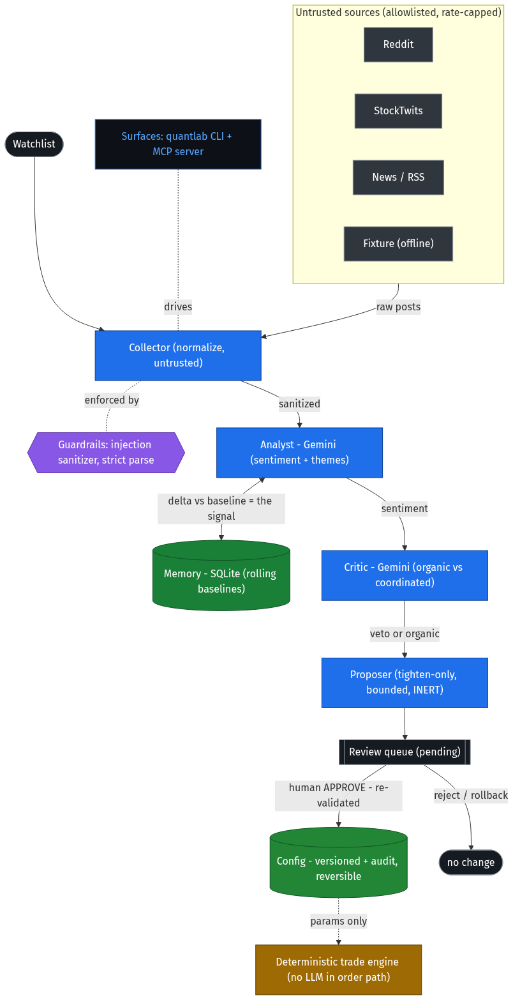
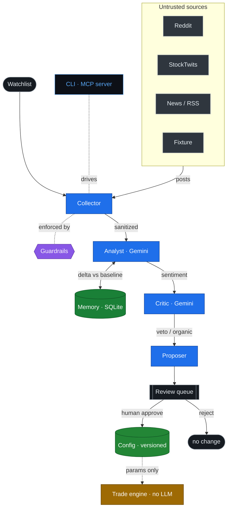

# QuantLab architecture

**Agents propose, humans dispose.** A pipeline of specialized Gemini agents turns untrusted market
chatter into a *bounded, human-approved* risk action. The LLM never touches the order path.

Editable Mermaid source (rendered to <code>architecture.png</code>/<code>.svg</code> via kroki.io)

To re-render after editing:
`curl -s https://kroki.io/mermaid/png --data-binary @architecture.mmd -o architecture.png`
(the ASCII-clean source lives in `architecture.mmd`).

**Legend — what each stage does:**
- **Collector** — pulls posts from allowlisted, rate-capped sources; treats every item as untrusted.
- **Guardrails** — prompt-injection sanitizer, strict-schema parsing, token budget (applied before any LLM call).
- **Analyst (Gemini)** — sentiment + confidence + themes; the signal is the **delta vs the ticker's rolling baseline** (from Memory).
- **Critic (Gemini + heuristics)** — organic vs coordinated / bot / echo; can **veto or downgrade** the analyst.
- **Proposer** — on a material, organic, bearish shift, emits a **tighten-only, bounded, evidence-linked** `ParamProposal` that is **inert**.
- **Review queue → human approve** — approval **re-validates against bounds**, writes a **versioned + audited** config change, and is **reversible**. This is the *only* path that changes config.
- **Trade engine** — reads config params only; the **LLM is never in the order path**.
- **Surfaces** — the `quantlab` CLI and an MCP server drive the same pipeline with identical guarantees.

**Key invariants (enforced in code, not by LLM goodwill):** tighten-only bounded proposals · inert
until human approval · critic can veto · LLM never in the order path.
